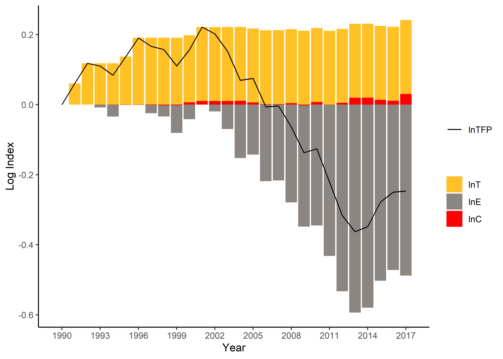

<!-- README.md is generated from README.Rmd. Please edit that file -->

# dfvad

<!-- badges: start -->

<!-- badges: end -->

## Overview

`dfvad` decomposes value added growth into explanatory factors. A cost
constrained value added function is defined to specify the production
frontier. Industry estimates can also be aggregated using a weighted
average approach.

## Installation

`dfvad` is available from <https://github.com/shipei-zeng/dfvad>. To
install it, `install_github` from the `devtools` package can be helpful.

``` r
devtools::install_github("shipei-zeng/dfvad")
```

If error messages show that the URL cannot be opened, please set the
download option before installing it.

``` r
options(download.file.method = "libcurl")
```

If error messages show that schannel failed to receive handshake, please
delete the previous package before updating it.

It has also been uploaded to the CRAN repository, which can be
downloaded using:

``` r
install.packages("dfvad")
```

## Usage

`value_decom()` for decomposing nominal value added growth identifies
the contributions from efficiency change, growth of primary inputs,
changes in output and input prices, technical progress and returns to
scale.

``` r
library(dfvad)
# Use the built-in dataset "mining"
table1 <- value_decom(c("h2","x2"), c("w2","u2"), "y2", "p2", "year", mining)[[1]]
head(table1)
#>   period     value     alpha      beta     gamma efficiency   epsilon      tau
#> 1   1991 1.0869517 1.0287049 0.9944262 1.0000000  1.0000000 1.0000000 1.062544
#> 2   1992 0.9960608 0.9523963 0.9874494 1.0000000  1.0000000 1.0000000 1.059140
#> 3   1993 1.0477108 1.0373754 1.0180111 0.9997303  0.9923619 0.9923619 1.000000
#> 4   1994 0.9773035 0.9605188 1.0444275 0.9996838  0.9670585 0.9745018 1.000000
#> 5   1995 1.0545680 0.9842271 1.0168128 0.9999874  1.0000000 1.0340636 1.019052
#> 6   1996 1.1345729 1.0406754 1.0327427 1.0000000  1.0000000 1.0000000 1.055662
#>        TFPG
#> 1 1.0625440
#> 2 1.0591398
#> 3 0.9920943
#> 4 0.9741937
#> 5 1.0537516
#> 6 1.0556623
table2 <- value_decom(c("h2","x2"), c("w2","u2"), "y2", "p2", "year", mining)[[2]]
head(table2)
#>   period    value         A         B         C         E        T      TFP
#> 1   1990 1.000000 1.0000000 1.0000000 1.0000000 1.0000000 1.000000 1.000000
#> 2   1991 1.086952 1.0287049 0.9944262 1.0000000 1.0000000 1.062544 1.062544
#> 3   1992 1.082670 0.9797347 0.9819455 1.0000000 1.0000000 1.125383 1.125383
#> 4   1993 1.134325 1.0163527 0.9996314 0.9997303 0.9923619 1.125383 1.116486
#> 5   1994 1.108580 0.9762259 1.0440425 0.9994142 0.9670585 1.125383 1.087673
#> 6   1995 1.169073 0.9608280 1.0615958 0.9994016 1.0000000 1.146824 1.146138
```

`t_weight()` follows a “bottom up” approach that uses weighted averages
of the sectoral decompositions to provide an approximate decomposition
into explanatory components at the aggregate level.

``` r
library(dfvad)
# Use the built-in dataset "sector"
table1 <- t_weight("y", "p", "industry", "year", "alpha", "beta", "gamma", "epsilon", "tau", sector)[[1]]
head(table1)
#>   period     value    alpha      beta     gamma   epsilon      tau      TFPG
#> 1   1991 0.9951654 1.004989 0.9878890 0.9996087 0.9868727 1.016024 1.0023647
#> 2   1992 1.0145281 1.015884 0.9869371 0.9987753 0.9962747 1.016905 1.0118834
#> 3   1993 1.0656435 1.034633 1.0128698 1.0002431 1.0011899 1.015434 1.0168858
#> 4   1994 1.0649234 1.007479 1.0291213 1.0001043 1.0029142 1.024013 1.0271072
#> 5   1995 1.0565961 1.020031 1.0378505 1.0010086 0.9871089 1.010072 0.9980697
#> 6   1996 1.0703334 1.019766 1.0212297 0.9998535 1.0097033 1.018044 1.0277682
table2 <- t_weight("y", "p", "industry", "year", "alpha", "beta", "gamma", "epsilon", "tau", sector)[[2]]
head(table2)
#>   period     value        A         B         C         E        T      TFP
#> 1   1990 1.0000000 1.000000 1.0000000 1.0000000 1.0000000 1.000000 1.000000
#> 2   1991 0.9951654 1.004989 0.9878890 0.9996087 0.9868727 1.016024 1.002365
#> 3   1992 1.0096232 1.020952 0.9749843 0.9983845 0.9831963 1.033200 1.014276
#> 4   1993 1.0758984 1.056311 0.9875322 0.9986272 0.9843662 1.049147 1.031403
#> 5   1994 1.1457494 1.064211 1.0162904 0.9987313 0.9872349 1.074340 1.059361
#> 6   1995 1.2105943 1.085528 1.0547575 0.9997387 0.9745083 1.085161 1.057317
```

## Display

Here is an example to plot the explanatory factors of productivity
(logarithmic indexes). Additional packages such as `ggplot2` and
`reshape2` are required.

``` r
library(dfvad)
library(ggplot2)
library(reshape2)
# Get the decomposition result
df <- value_decom(c("h2","x2"), c("w2","u2"), "y2", "p2", "year", mining)[[2]]
# Extract columns and rename
df_cmpt <- data.frame(df[,"period"], log(df[,c("T", "E", "C")]))
colnames(df_cmpt) <- c("year", "lnT", "lnE", "lnC")
df_tfp <- data.frame(df[,"period"], log(df[,"TFP"]))
colnames(df_tfp) <- c("year", "lnTFP")
# Set the colour scheme
palette_a <- c("goldenrod1", "seashell4", "red")
# Convert data into a tidy form
df_cmpt_tidy <- melt(df_cmpt, id.vars="year")
# Plot the components
plot_out <- ggplot(df_cmpt_tidy) + geom_bar(aes(x=year, y=value, fill=variable), stat="identity") +
        geom_line(data=df_tfp, aes(x=year,y=lnTFP,color='black'), lwd=0.5) +
        ylab('Log Index') + xlab('Year') + 
        scale_fill_manual("", values=palette_a) + 
        scale_colour_manual("", values=c('black'='black'), labels = c('lnTFP')) + 
        scale_x_continuous(breaks = seq(min(df$period), max(df$period), by = 3)) + 
        theme_classic()
print(plot_out)
```


